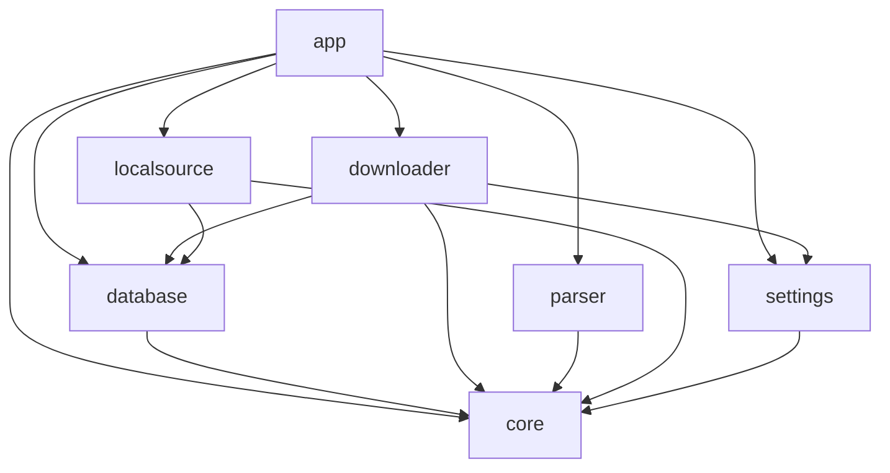

# Architecture: FMD2 Mobile

FMD2 Mobile is built using Clean Architecture guidelines and Strict Layered Modularization to keep the UI decoupled from backend networks and local databases.

## Module Graph

## Layers

1. **Presentation Layer (`:app`, `:settings`)**
   - Jetpack Compose UI Screens (`LibraryScreen`, `BrowseScreen`, `DownloadsScreen`, `ReaderScreen`, `MangaDetailsScreen`).
   - ViewModels managing screen states and UI actions.
   - Core Navigation configurations (`NavGraph`).

2. **Data Layer (`:database`, `:downloader`, `:parser`, `:localsource`)**
   - Room Database implementations and entity mappers.
   - OkHttp network engines and Jsoup scrapers.
   - WorkManager tasks executing downloads.
   - CBZ and file formatting for Mihon compatibility.

3. **Domain Layer (`:core`)**
   - Pure Kotlin data structures (models).
   - Repository interfaces defining CRUD operations.
   - Scraper interface definitions (`MangaSource`).
